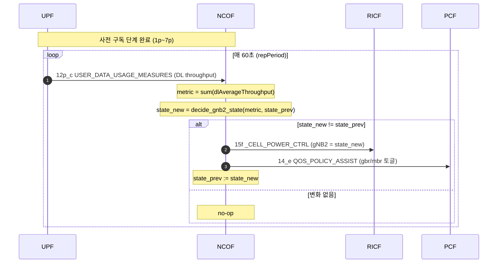

# WLAN-triggered gNB2 Power & QoS Adaptation — Rule-based Baseline

**대상 독자**: ModuTec NCOF 개발팀
**작성**: ETRI 박세형 (6G-I2P PoC 조율 담당)
**관련**: 고려대 백상헌 교수님 팀 RL 모델 — 본 룰 알고리즘이 baseline / fallback
**참조 구현**: [`tools/decide_wlan_gnb2_rule.py`](./decide_wlan_gnb2_rule.py)

---

## 1. 목적 한 줄

> **"단일 WLAN 측정치 하나만 보고 gNB2를 재우거나 깨우고, 그에 맞춰 코어망 QoS도 같이 뒤집는다."**

전체 PoC 시나리오(다소스 융합 + 5개 룰을 쓰는 `tools/decide_cell_power.py`)를 의도적으로 단순화한 **첫 단계 baseline**입니다.
RL 모델이 완성/연동되기 전까지 ModuTec NCOF가 안정적으로 데모할 수 있게 하기 위함이고,
같은 입출력 인터페이스를 RL 모델이 그대로 이어받을 수 있게 설계했습니다.

---

## 2. 동작 그림

```
                            +---------------------------+
   UPF → NCOF (12p_c)      |                           |   NCOF → RICF (15f)
   USER_DATA_USAGE_MEASURES |          NCOF             |   _CELL_POWER_CTRL
   (DL throughput)   ─────► |   decide_wlan_gnb2_rule   | ────► gNB2 DEEP_SLEEP/ACTIVE
                            |                           |
                            |  hysteresis: TH_LOW/HIGH  |   NCOF → PCF (14_e)
                            |                           |   QOS_POLICY_ASSIST
                            |                           | ────► 3GPP/WLAN gbr/mbr 토글
                            +---------------------------+
```

---

## 3. 입력 (Single source)

- **출처**: UPF → NCOF, `Nupf_EventExposure` Notification
- **이벤트**: `USER_DATA_USAGE_MEASURES` (= 기존 `ncof_json/12p_c_NotificationData_from_UPF_to_NCOF_v1.0.json` 모양)
- **사용 필드**: `notificationItems[].userDataUsageMeasurements[].throughputStatisticsMeasurement.dlAverageThroughput`
- **계산**: 보고된 모든 flow의 DL throughput **합** (단위 Mbps)

> 단순화 주의: 본 baseline은 12p_c 보고치 **전체**를 Non-3GPP/WLAN 부하 proxy로 간주합니다. ModuTec이 별도 `WLAN_PERFORMANCE` 이벤트(1p 구독에 이미 포함됨)를 받아 BSSID 단위로 분리할 수 있게 되면 `extract_wlan_dl_mbps()` 함수만 교체하면 됩니다 — 결정·출력 로직은 그대로.

---

## 4. 결정 규칙 (Hysteresis)

```
metric = WLAN aggregate DL throughput (Mbps)

  metric >= TH_HIGH (default 500 Mbps)  ─► gNB2 = DEEP_SLEEP
  metric <= TH_LOW  (default 300 Mbps)  ─► gNB2 = ACTIVE
  TH_LOW < metric < TH_HIGH             ─► gNB2 = previous_state  (밴드 내 유지)
```

State machine:

```
                  metric >= TH_HIGH
    ┌─────────┐  ───────────────────►  ┌────────────┐
    │ ACTIVE  │                         │ DEEP_SLEEP │
    └─────────┘  ◄───────────────────  └────────────┘
                  metric <= TH_LOW
```

**왜 hysteresis?** 단일 threshold(예: 400 Mbps 하나)만 쓰면 measure가 그 경계 주변에서 떨릴 때마다 gNB2 power state가 펄럭여 RAN/CN 양쪽 모두 짐. TH_LOW < TH_HIGH 두 점을 두면 "한 번 들어가면 충분히 떨어져야 나오는" 안정적 상태 전이가 됩니다.

**튜닝 가이드**:
- 둘 다 크게 (예: 800/600) → DEEP_SLEEP이 잘 발동 안 됨 (보수적, 에너지 절감 적음)
- 둘 다 작게 (예: 200/100) → 거의 항상 DEEP_SLEEP (공격적)
- 간격 크게 (예: 800/200) → 한 번 전환되면 잘 안 바뀜 (느린 응답)
- 간격 작게 (예: 510/490) → 거의 단일 threshold처럼 동작 (불안정 위험)

---

## 5. QoS 정책 매핑 (CN 측)

`gNB2`의 새 state에 따라 14_e 출력의 `qosPolAssistSets[]`를 다음과 같이 변환합니다:

| 정책 set 분류 | 식별 방법 | DEEP_SLEEP일 때 | ACTIVE일 때 |
|---|---|---|---|
| **WLAN 경로** | `ratTypes` 에 `"WLAN"` 포함 | `gbrDl=1000 Mbps, mbrDl=1000 Mbps` | `gbrDl=0 Mbps, mbrDl=0 Mbps` |
| **3GPP-on-gNB2** | `ratTypes`=`["NR"]` & `spatialValidity.gRanNodeIds[].gNbId.gNBValue == "000002"` | `gbrDl=0 Mbps, mbrDl=0 Mbps` | `gbrDl=1000 Mbps, mbrDl=1000 Mbps` |
| **3GPP-on-gNB1 (primary)** | 위 둘 다 아님 | (변경 없음) | (변경 없음) |

직관: **활성화된 액세스 경로의 QoS만 살리고 나머지는 0으로 떨군다**. gNB2가 잘 때 UE는 Wi-Fi로 오프로드되므로 WLAN gbr/mbr을 풀어주고, gNB2의 NR 경로는 사실상 비활성화. 깨어나면 그 반대.

---

## 6. 출력 (두 개의 Notification)

### 6.1 NCOF → RICF — `15f` shape (cell power)

JSON 전체 모양은 `ncof_json/15f_NncofEventsSubscriptionNotification_from NCOF_to_RICF_v1.0.json` 동일. 핵심 가변 필드:

- `_cellPowerParamSets[0]._spatialValidity.gRanNodeIds[].gNbId.gNBValue` = `"000002"` (gNB2 고정)
- `_cellPowerParamSets[0]._cellPowerParamSet._cellPowerState` = `"DEEP_SLEEP"` 또는 `"ACTIVE"`
- `_cellTxPower` 외 RF 파라미터 8종은 state별 preset 적용 (`decide_wlan_gnb2_rule.py`의 `CELL_POWER_PRESETS` 참고, 기존 `decide_cell_power.py`와 동일 값)

**발화 시점**: state가 **바뀌었을 때만** 보내는 것을 권장. 다만 RL 연동 시 expiry 갱신용 keepalive가 필요해질 수 있으므로 ModuTec 구현에서 옵션화해두면 좋습니다 (참조 구현은 매 결정마다 emit, 호출자가 dedup).

### 6.2 NCOF → PCF — `14_e` shape (QoS policy assist)

JSON 전체 모양은 `ncof_json/14_e_NncofEventsSubscriptionNotification_from NCOF_to_PCF_v1.0.json` 동일. 4개의 `qosPolAssistSets[]` 각각에 §5 매핑을 적용해 `qosParamSet.gbrDl`/`mbrDl`만 갱신.

---

## 7. 시퀀스 다이어그램 (의사 mermaid)



---

## 8. State 보관 책임

룰은 hysteresis이므로 NCOF가 **gNB2의 직전 state를 메모리(또는 외부 저장)에 들고 있어야** 합니다. 권장 모델:

```python
class Gnb2RuleEngine:
    def __init__(self, th_high=500.0, th_low=300.0):
        self.th_high = th_high
        self.th_low = th_low
        self.state = "ACTIVE"   # cold-start default

    def on_wlan_notification(self, notif_12p_c, decision_iso) -> dict | None:
        metric = extract_wlan_dl_mbps(notif_12p_c)
        new_state = decide_gnb2_state(metric, self.state, self.th_high, self.th_low)
        if new_state == self.state:
            return None   # no change → 통지 안 보냄
        self.state = new_state
        return {
            "cell_power_15f": build_15f_cell_power(new_state, decision_iso, ...),
            "qos_policy_14e": apply_qos_policy(qos_template, new_state),
        }
```

- **Cold start**: 첫 결정 직전에는 직전 state가 없으므로 `ACTIVE`로 가정.
- **재시작 시 복구**: NCOF가 재시작하면 직전 state가 휘발됨. RICF에 현재 cell state를 조회하거나, NCOF에 state 캐시(파일/Redis 등)를 두는 것을 권장.

---

## 9. Edge Cases & Operational Notes

| 상황 | 동작 | 비고 |
|---|---|---|
| `userDataUsageMeasurements` 비어있음 | metric=0 → 룰 평가 (보통 ACTIVE 유지) | log: `metric=0.0` |
| `throughputStatisticsMeasurement` 없음 / 단위 인식 실패 | 해당 flow 0으로 처리 | `_parse_mbps` 가 silent fallback |
| `timeStamp` 누락 | decision_iso = `_now_iso_kst()` | 결정 시각 일관성 확보 |
| metric이 hysteresis band 안에서 진동 | state 유지, notification 미발화 | 의도된 동작 |
| gNB2가 토폴로지에 부재 (재구성됨) | cell power notification은 보내되 RICF가 reject 가능 | NCOF는 NRF 조회로 보완 가능 |
| WLAN과 gNB2 둘 다 동시에 죽는 시나리오 | 본 룰 범위 밖 (RL 또는 multi-source 룰 필요) | `decide_cell_power.py`의 R4 참조 |

---

## 10. Tunables — 한눈에

| 이름 | 기본값 | 의미 |
|---|---|---|
| `TH_HIGH_MBPS` | `500.0` | 이 이상이면 DEEP_SLEEP 결정 |
| `TH_LOW_MBPS` | `300.0` | 이 이하이면 ACTIVE 결정 |
| `GNB2_VALUE` | `"000002"` | 룰이 제어할 gNB의 `gNBValue` |
| `GNB1_VALUE` | `"000001"` | primary cell (본 룰이 절대 건드리지 않음) |
| `GBR_HIGH_MBPS` | `1000.0` | "fully on" 측 gbr/mbr |
| `GBR_OFF_MBPS` | `0.0` | "fully off" 측 gbr/mbr |
| `SUB_DURATION` | 60초 | notification 시간창 |

데모 환경 측정해 보고 TH_HIGH/TH_LOW만 환경값으로 빼두면 ModuTec 입장에서 튜닝 용이.

---

## 11. 참조 구현 실행

```bash
# 기본 — PoC 샘플 JSON 그대로 사용 (직전 state = ACTIVE)
python3 tools/decide_wlan_gnb2_rule.py

# 직전 state와 threshold 조정해서 시나리오 재현
python3 tools/decide_wlan_gnb2_rule.py --prev-state DEEP_SLEEP --th-high 800 --th-low 400

# 다른 입력 파일 사용
python3 tools/decide_wlan_gnb2_rule.py --wlan-input my_wlan_notif.json
```

출력은 stdout에 두 JSON이 `===15f===` / `===14e===` 마커로 구분되어 나옵니다 (파이프/스플릿 친화).
결정 진단(metric, threshold, 결정 결과)은 stderr로 분리.

---

## 12. RL 모델 연동을 위한 인터페이스 약속

백상헌 교수님 팀 RL 모델이 합류할 때, 본 baseline과 **같은 입출력 인터페이스**를 유지하면 NCOF 내부에서 "엔진 한 줄 교체"로 전환 가능합니다:

```
input:  WLAN notification(s) (12p_c shape) + (optional) richer context
output: (cell_power_15f_payload, qos_policy_14e_payload, change_indicator)
```

`Gnb2RuleEngine` 자리에 `Gnb2RLEngine`만 갈아끼우는 식. 본 baseline은 그 자리에 들어갈 reference shape입니다.

---

**문의**: 박세형 (justin.labry@gmail.com) — 시나리오/스키마 관련
**구현 상세 문의**: ModuTec 개발팀 내부 채널
**RL 모델 인터페이스**: 별도 협의 (백상헌 교수님 팀과 ETRI)
